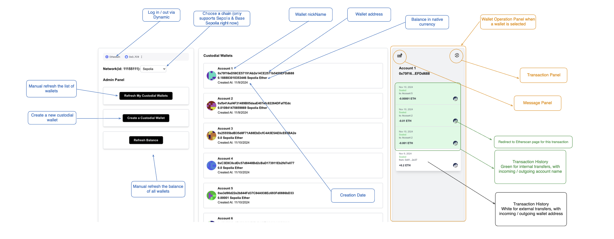
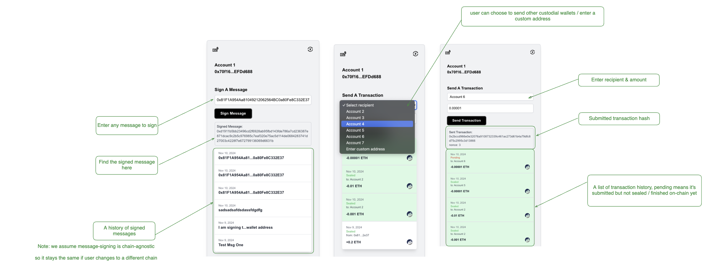

# VenCura - A Full Stack Demo for Custodial Wallets

## Overview

VenCura is a comprehensive custodial wallet platform for EVM (Ethereum Virtual Machine) networks, built to showcase secure wallet management and multi-chain compatibility within a modern Web3 application.

This monorepo includes:

- **Backend**: Developed with **NestJS** and **Prisma** for seamless interactions with PostgreSQL. Deployed via a CI/CD pipeline on **Google Cloud Platform (GCP)**.
- **Frontend**: A responsive **Next.js** application that integrates wallet functionalities for a smooth and intuitive user experience.

## Author

**Alfred L.**

- **GitHub**: [https://github.com/alliu930410](https://github.com/alliu930410)
- **Email**: [alfredliu07@gmail.com](mailto:alfredliu07@gmail.com)

## 🚀 Live Demo

- **Frontend App**: [VenCura on Vercel](https://dynamic-ven-cura.vercel.app/)
- **Backend API**: [VenCura Backend API](https://ven-cura-backend-162382446001.us-central1.run.app/api)

> **Note**: CORS is configured to only allow requests from:
>
> - `http://localhost:3003/`
> - `https://dynamic-ven-cura.vercel.app/`
>
> Additionally, please be aware that requests may be delayed, as the hosting instance enters idle mode after 15 minutes of inactivity.

> We utilize [Dynamic](https://www.dynamic.xyz/) for streamlined authentication, offering seamless Web3 login across multiple wallet providers and chains. Dynamic also supports Web2 authentication options, such as Google and email, for a flexible, user-friendly login experience.

## Running the App Locally

> **Note**: All commands are executed from the root directory of this repository.

### Database (Starting PostgreSQL)

1. Navigate to the backend directory: `cd backend`
2. Run `yarn docker:dev:up` to start a PostgreSQL container (use `docker ps` to check running containers; you should see `ven_cura_local` mapped to port 5432).

### Backend

#### Running the API Server

1. Navigate to the backend directory: `cd backend`
2. Install dependencies: `yarn`
3. Ensure the PostgreSQL container is running (see the **Database** section above).
4. Create a `.env` file by copying `.env.example`. Update the following variables:
   - `WALLET_ENCRYPTION_KEY` with any secure string
   - `ALCHEMY_API_KEY` and `ETHERSCAN_API_KEY`, which can be obtained from [Alchemy](https://www.alchemy.com/) and [Etherscan](https://etherscan.io/).
5. Apply Prisma migrations: `yarn migrate:dev`
6. Start the API server: `yarn start:dev`
   - Access the server at [http://localhost:3000](http://localhost:3000)
   - View the API documentation at [http://localhost:3000/api](http://localhost:3000/api) (Swagger).

#### Running Tests

1. Navigate to the backend directory: `cd backend`
2. Run `yarn test` to execute the tests, which cover:
   - Controller logic for the `/custodial` entity (note: services are tested within the controllers)
   - Key generation validation for required fields
   - Crypto encryption verification (see details in the **Security** section below)

### Frontend

1. Ensure the backend database and API are running (see above).
2. Navigate to the frontend directory: `cd frontend`
3. Install dependencies: `yarn`
4. Create an `.env` file and add `NEXT_PUBLIC_API_URL=http://localhost:3000`
5. Start the frontend: `yarn dev`
   - Access the frontend at [http://localhost:3003](http://localhost:3003)

## [Backend] Deployment to GCP (Google Cloud Platform) & CI/CD Pipeline

> **Note**: Before proceeding, create a GCP project. IAM and service setups vary across projects, so they are not included here. Instead, the required configuration files are outlined below:

- `/backend/Dockerfile`: Dockerfile for building the base image
- `/deploy/cloudbuild.staging.yaml`: YAML configuration for the CI/CD pipeline, including steps for each commit or push to the repository (currently triggered only on pushes to the `main` branch)

### CI/CD Pipeline Steps

1. **Build Container Image**  
   Uses `/backend/Dockerfile` to create the container image.

2. **Push Image to GCP**  
   Uploads the container image to Google Container Registry.

3. **Spin up a PostgreSQL Database**  
   Initializes a PostgreSQL instance in the Cloud Build environment for testing purposes.

4. **Run Unit Tests**  
   Executes unit tests in the Cloud Build environment.

5. **Shutdown PostgreSQL Database**  
   Shuts down the test PostgreSQL instance gracefully after testing.

6. **Create Cloud SQL Socket Connection**  
   Utilizes GCP Cloud SQL Auth proxy to establish a secure socket connection to the Cloud SQL instance on local port 5544, then applies Prisma migrations.

7. **Deploy to Cloud Run**  
   Deploys the built container to a Cloud Run instance.

## Security

### Authentication

- **[Frontend]**: We use Dynamic for login and authentication. An `authToken` is created when a user logs in via Dynamic.
- **[Backend]**: We implement a generic `JwtAuthGuard` to secure all API requests requiring authentication. This guard uses Dynamic's public key to decode or reject requests.

### Wallet Private Key Security

> **Key Creation**: We use the native crypto package to generate private keys.

> **Key Security**: The `encryptKey` and `decryptKey` implementations are located in `/backend/utils/crypto.ts`.

1. **Encryption**: A random initialization vector (IV) is generated, and the key is encoded using the `WALLET_ENCRYPTION_KEY` buffer, retrieved from environment variables. Both the `encryptedKey` and the IV are stored in the database.

2. **Decryption**: We decrypt the `encryptedKey` and IV using the `WALLET_ENCRYPTION_KEY` buffer from environment variables.

This approach ensures that, even in the event of a database leak, private keys remain secure, as decryption requires knowledge of the `WALLET_ENCRYPTION_KEY`.
